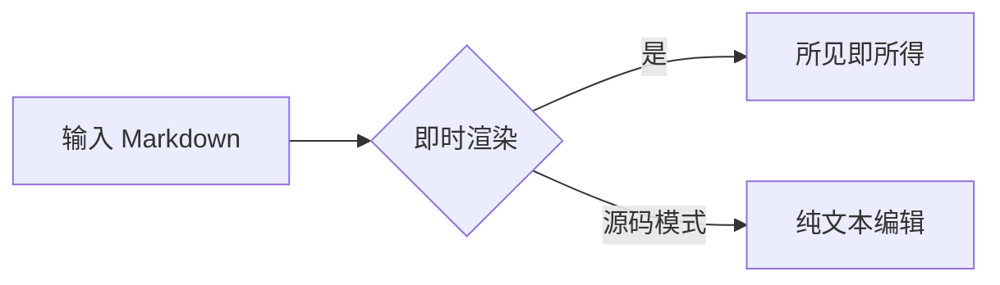

# 欢迎使用 Mswrite

一款**所见即所得**的 Markdown 编辑器 —— 打字即渲染,像写 Word 一样写 Markdown。

## 开始

- 直接在下方输入,左侧 `#` + 空格 回车即变标题
- 粘贴截图,图片自动存入中央图片库(与 Typora 默认行为一致)
- `Ctrl+/` 可切换源码模式,`Ctrl+S` 保存,`Ctrl+O` 打开

## 支持的语法

1. 列表(有序 / 无序 / 任务)
2. 表格、脚注、引用、分割线
3. 数学公式:$E = mc^2$,或块级公式:

$$
\int_0^\infty e^{-x^2} \, dx = \frac{\sqrt{\pi}}{2}
$$

4. 代码高亮:

```cpp
#include <cstdio>
int main() {
    printf("Hello, Mswrite!\n");
    return 0;
}
```

5. 流程图与图表(Mermaid):



| 特性 | 说明 |
| ---- | ---- |
| 内核 | Qt C++ + WebView2 |
| 引擎 | Vditor 即时渲染 |
| 平台 | Windows 10/11 |

> 点击左侧「大纲」可快速跳转标题;状态栏实时显示字数与行列。

---

*把这份欢迎稿删掉,开始你的第一篇文档吧!*
